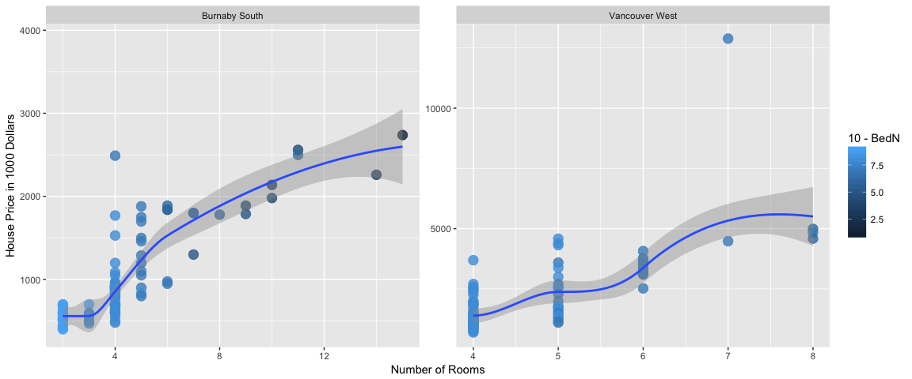
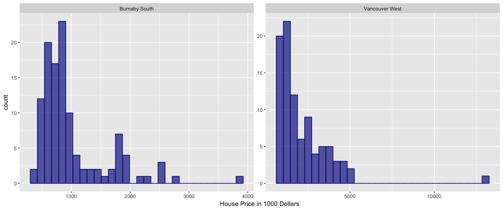
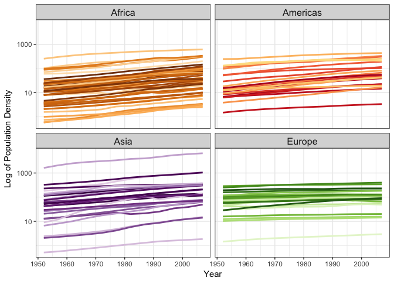

HW10 Data from the Web
================

Task 1: Make API queries "by hand" using `httr`
-----------------------------------------------

Pre-Work
--------

Load the required packages needed for the assignment.

``` r
library(httr)
library(dplyr)
library(glue)
library(purrr)
library(jsonlite)
library(tidyr)
```

API info is obtained from the website [`Star Wars API`](https://swapi.co). I noticed for this particular website, the authorization token is nor required when requiring a API.

But in fact, there are some websites requesting the authorization token. Here is one which we have illustrated in the class.

``` r
thor_result <- httr::GET(url = "http://www.omdbapi.com/?t=Thor&y=2017&apikey=df5f9e85")
thor_content <- content(thor_result)

thor_content %>%
    head() 
```

    ## $Title
    ## [1] "Thor: Ragnarok"
    ## 
    ## $Year
    ## [1] "2017"
    ## 
    ## $Rated
    ## [1] "PG-13"
    ## 
    ## $Released
    ## [1] "03 Nov 2017"
    ## 
    ## $Runtime
    ## [1] "130 min"
    ## 
    ## $Genre
    ## [1] "Action, Adventure, Comedy"

#### Simple example

There are several infomation we can search in the swqpi.co website, we can input a particular Star Wars `character` by the number, and a sequence of info regarding that `character` will appear, such as name, height, gender, links of the `films` this `character` is in, links of the `starships`. Alternatively, we can input a `film` number, as before, detailed info of that film will appear, such as, film name, film release date, link os `characters` who are involved in that film. Similarly, the `starships` inquery include info such as starship name, who were in the ship, and this ship appears in which movie.

As you can see, each webpage is not on its own. There exist some relationships in between.

First, we will try our function in the `vehicles` search and see whether we can get some result from the following simple code.

``` r
veh_res <- httr::GET(url = "https://swapi.co/api/vehicles/4/")
veh_content <- content(veh_res)
veh_content %>%
    head()
```

$name \[1\] "Sand Crawler"

$model \[1\] "Digger Crawler"

$manufacturer \[1\] "Corellia Mining Corporation"

$cost\_in\_credits \[1\] "150000"

$length \[1\] "36.8"

$max\_atmosphering\_speed \[1\] "30"

#### Function to retrieve detailed info

``` r
getChar_info <- function(number){
    res <- glue("https://swapi.co/api/people/{number}/") %>% 
        GET() %>% 
        content()
    return(res)
}
```

In the next chunk, I will demostrate how to use the info to generate a nice and tidy dataframe.

The idea of my dataframe is to list out the character, and the movies that character was in, also, within each movies, I need to find out the `starship(s)` that are relevant to the `character`. Note: I am not going to list all the `starship(s)` appear in the movie that `character` was in, which means even though the `starship(s)` and `character` are in the same film of a particular year, there might be a chance that the `character` has no relationship with the `starship(s)`.

I intend to get the infomation of `name`, `gender`, and `species` directly from the webpage of `character/people`, and get the information of `film_name` and `release_year` from the webpage `films`. As for the `starship(s)` which are relevant to the `character`, I will first find all the `starship(s)` that are relevant to the `character` aross all the Star Wars films, and then categorize them into different `films`, and finally match with the existing categorized `character`.

``` r
moreInfo <- function(oneList, title = "title"){
    if(title == "title"){
        unlist(oneList$title)
    }else if(title == "year"){
        unlist(oneList$release_date)
    }else if(title == "films"){
        unlist(oneList$films)
    }else if(title == "shipname"){
        unlist(oneList$name)
    }
}


convertTibble <- function(list){
    listSpecies <- fromJSON(unlist(list$species))
    filmInfo <- map(list$films, fromJSON)
    listFilms <- map(filmInfo, "title", moreInfo)
    listYears <- map2(filmInfo, "year", moreInfo) %>%
        substr(1,4)
    
    
    #listStarships
    starshipInfo <- map(list$starships, fromJSON)
    shipFilmWeb <- map(starshipInfo, "films", moreInfo)
    
    film_starship_df <-
        tibble(shipname = map2(starshipInfo, "shipname", moreInfo) %>%
                        unlist(),
                     filmWeb = shipFilmWeb) %>%
        unnest()
    
    #listFilms
    cha_film_df <-
        tibble(
            name = list$name,
            gender = list$gender,
            species = listSpecies$name,
            filmWeb = unlist(list$films),
            film_name = unlist(listFilms),
            release_year = unlist(listYears)
        )
    
    left_join(cha_film_df,
                        aggregate(film_starship_df[1], film_starship_df[2], unique),
                        by = "filmWeb") %>%
        mutate(shipNum = map_int(shipname, length)) %>%
        select(name:species, film_name, release_year, shipNum, shipname) %>%
        arrange(release_year) %>%
        return()
}

char1 <- convertTibble(getChar_info("1"))

char1 %>%
    knitr::kable()
```

| name           | gender | species | film\_name              | release\_year |  shipNum| shipname                 |
|:---------------|:-------|:--------|:------------------------|:--------------|--------:|:-------------------------|
| Luke Skywalker | male   | Human   | A New Hope              | 1977          |        1| X-wing                   |
| Luke Skywalker | male   | Human   | The Empire Strikes Back | 1980          |        2| X-wing, Imperial shuttle |
| Luke Skywalker | male   | Human   | Return of the Jedi      | 1983          |        2| X-wing, Imperial shuttle |
| Luke Skywalker | male   | Human   | Revenge of the Sith     | 2005          |        0| NULL                     |
| Luke Skywalker | male   | Human   | The Force Awakens       | 2015          |        0| NULL                     |

It could be seen that the character of `Luke Skywalker` appears in 5 films of the Star Wars series, and the year range was from 1997 to 2015, also, in the first few editions of the films, the character had/travelled in some starships, but in latter years, he has no relationship with any starships.

Task 2: Scrape data
-------------------

#### Pre-Work

``` r
library(rvest)
library(ggplot2)
vignette("selectorgadget")
```

#### Taks2.1 Review Slides

Work through the [final set of slides](https://github.com/ropensci/user2016-tutorial/blob/master/03-scraping-data-without-an-api.pdf) from the rOpenSci UseR! 2016 workshop. This will give you basic orientation, skills, and pointers on the rvest package.

``` r
frozen <- read_html("http://www.imdb.com/title/tt2294629/")
itals <- html_nodes(frozen, "em")
html_text(itals)
```

    ## [1] "Written by\nDeAlan Wilson for ComedyE.com"

``` r
html_name(itals)
```

    ## [1] "em"

``` r
html_children(itals)
```

    ## {xml_nodeset (1)}
    ## [1] <a href="/search/title?plot_author=DeAlan%20Wilson%20for%20ComedyE.c ...

``` r
html_attr(itals, "class")
```

    ## [1] "nobr"

``` r
html_attrs(itals)
```

    ## [[1]]
    ##  class 
    ## "nobr"

``` r
cast2 <- html_nodes(frozen, "#titleCast span.itemprop")
html_text(cast2)
```

    ##  [1] "Kristen Bell"        "Idina Menzel"        "Jonathan Groff"     
    ##  [4] "Josh Gad"            "Santino Fontana"     "Alan Tudyk"         
    ##  [7] "Ciarán Hinds"        "Chris Williams"      "Stephen J. Anderson"
    ## [10] "Maia Wilson"         "Edie McClurg"        "Robert Pine"        
    ## [13] "Maurice LaMarche"    "Livvy Stubenrauch"   "Eva Bella"

``` r
cast3 <- html_nodes(frozen, ".itemprop .itemprop")
html_text(cast3)
```

    ##  [1] "Kristen Bell"        "Idina Menzel"        "Jonathan Groff"     
    ##  [4] "Josh Gad"            "Santino Fontana"     "Alan Tudyk"         
    ##  [7] "Ciarán Hinds"        "Chris Williams"      "Stephen J. Anderson"
    ## [10] "Maia Wilson"         "Edie McClurg"        "Robert Pine"        
    ## [13] "Maurice LaMarche"    "Livvy Stubenrauch"   "Eva Bella"

``` r
kw <- read_html("https://www.bestplaces.net/cost_of_living/city/florida/key_west")
col <- html_nodes(kw, css = "#mainContent_dgCostOfLiving tr:nth-child(2) td:nth-child(2)")
html_text(col)
```

    ## [1] "171"

``` r
tables <- html_nodes(kw, css = "table")
html_table(tables, header = TRUE, fill = TRUE)[[2]]
```

    ##   COST OF LIVING Key West, Florida United States
    ## 1        Overall             171.0           100
    ## 2        Grocery             102.8           100
    ## 3         Health             102.0           100
    ## 4        Housing             319.0           100
    ## 5      Utilities              97.0           100
    ## 6 Transportation             103.0           100
    ## 7  Miscellaneous             101.0           100

``` r
kw2 <- read_html("https://www.bestplaces.net/climate/city/florida/key_west")
climate <- html_nodes(kw2, css = "table")
html_table(climate, header = TRUE, fill = TRUE)[[2]]
```

    ##                         CLIMATE Key West, Florida United States
    ## 1                Rainfall (in.)           39.9054          39.2
    ## 2                Snowfall (in.)            0.0000          25.8
    ## 3            Precipitation Days           61.7000           102
    ## 4                    Sunny Days          260.0000           205
    ## 5                Avg. July High           89.3620          86.1
    ## 6                 Avg. Jan. Low           64.1260          22.6
    ## 7 Comfort Index (higher=better)           94.0000            54
    ## 8                      UV Index            7.2000           4.3
    ## 9                 Elevation ft.            6.0000         1,443

#### Taks2.2 Scrap Your Own Data

In this task, I will analyze the recent listed house information located in the central location of Vancouver (i.e. Downtown Vancouver West) and central location of Burnaby (i.e. Metrotown) obtained from [`The Rick Clarke Team`](http://www.realestatevalley.ca/). I will detailed break down my solution when analyzing the info for Downtown Vancouver West, and will bulk extract info for Metrotown.

``` r
source("read_dat.R")
info_van <- info_bur <- list()
df_van <- df_bur <- c()
for(i in 1:length(h)){
    info_van[[i]] <- html_nodes(h[[i]], css = "dd")
    info_text <- html_text(info_van[[i]])
    pageHouse <- matrix(NA, nrow = length(info_text)/9, ncol = 9) %>%
            data.frame()
    for(j in 1:length(info_text)){
        pageHouse[floor(j/10 + 1), ifelse(j %% 9 == 0, 9, j %% 9)] <- info_text[j]
    }
    df_van <- bind_rows(df_van, pageHouse %>%na.omit())
}

df_van[1,] %>%
    knitr::kable()
```

| X1          | X2        | X3  | X4  | X5                   | X6       | X7                        | X8             | X9          |
|:------------|:----------|:----|:----|:---------------------|:---------|:--------------------------|:---------------|:------------|
| $12,888,000 | Vancouver | 3   | 4   | Residential Attached | R2205230 | \# 4701 938 Nelson Street | Vancouver West | Downtown VW |

I noticed even though we have got infomation from the website, the colnames info is still missing. So, we need to extract info from the website again for the colnames.

``` r
cap <- read_html("http://www.realestatevalley.ca/burnaby-real-estate.php#detailed")
name <- 
    html_nodes(cap, "#listing-R2221141 dt") %>%
    html_text()
name
```

    ## [1] "Price:"       "City:"        "Beds:"        "Baths:"      
    ## [5] "Type:"        "MLS® #:"      "Address:"     "Area:"       
    ## [9] "Subdivision:"

After extract the plain text info of column names, I found it is not in good format, i.e. there are `:`s after the names, so I am extract the character info before `:`s.

``` r
names(df_van) <- name %>%
    substr(1,regexpr(":", name)-1)

dim(df_van)
```

    ## [1] 92  9

After renaming the data frame, we got 92 rows, which means we got 92 houses' info. Let's have a look at the head part of data frame.

Before using the data frame `df_van` doing any analysis, we need to change to character columns to number columns, such as `Price`, `Beds`, `Baths`

``` r
remDol <- function(char){
    gsub(",","",char) %>%
        substr(2, nchar(char))
}

van_house_dat <- 
    df_van %>%
    mutate(BedN = as.numeric(df_van$Beds),
                 BathN = as.numeric(df_van$Baths),
                 PriceChar = unlist(map(df_van$Price, remDol)), 
                 PriceInK = round(as.numeric(PriceChar)/1000, 0)) %>%
    select(`MLS® #`, PriceInK, BedN:BathN, Type, Address, Subdivision, Area) %>%
    mutate(roomN = BedN + BathN)

van_house_dat %>%
    head(10) %>%
    knitr::kable()
```

| MLS® \#  |  PriceInK|  BedN|  BathN| Type                 | Address                       | Subdivision | Area           |  roomN|
|:---------|---------:|-----:|------:|:---------------------|:------------------------------|:------------|:---------------|------:|
| R2205230 |     12888|     3|      4| Residential Attached | \# 4701 938 Nelson Street     | Downtown VW | Vancouver West |      7|
| R2208011 |      4989|     4|      4| Residential Attached | \# 1602 667 Howe Street       | Downtown VW | Vancouver West |      8|
| R2134299 |      4840|     3|      5| Residential Attached | \# 5001 1480 Howe Street      | Downtown VW | Vancouver West |      8|
| R2225747 |      4588|     4|      4| Residential Attached | \# 1403 1335 Howe Street      | Downtown VW | Vancouver West |      8|
| R2226517 |      4584|     2|      3| Residential Attached | \# Ph9 777 Richards Street    | Downtown VW | Vancouver West |      5|
| R2210404 |      4480|     3|      4| Residential Attached | \# 2601 885 Cambie Street     | Downtown VW | Vancouver West |      7|
| R2187335 |      4398|     2|      3| Residential Attached | \# 2402 1335 Howe Street      | Downtown VW | Vancouver West |      5|
| R2224334 |      4318|     2|      3| Residential Attached | \# 3504 838 W Hastings Street | Downtown VW | Vancouver West |      5|
| R2207903 |      4070|     3|      3| Residential Attached | \# Ph2 777 Richards Street    | Downtown VW | Vancouver West |      6|
| R2163601 |      3780|     3|      3| Residential Attached | \# 4905 777 Richards Street   | Downtown VW | Vancouver West |      6|

Let's analyze the Burnaby's data.

``` r
for(i in 1:length(b)){
    info_bur[[i]] <- html_nodes(b[[i]], css = "dd")
    info_text <- html_text(info_bur[[i]])
    pageHouse <- matrix(NA, nrow = length(info_text)/9, ncol = 9) %>%
        data.frame()
    for(j in 1:length(info_text)){
        pageHouse[floor(j/10 + 1), ifelse(j %% 9 == 0, 9, j %% 9)] <- info_text[j]
    }
    df_bur <- bind_rows(df_bur, pageHouse %>%na.omit())
}

names(df_bur) <- name %>%
    substr(1,regexpr(":", name)-1)

bur_house_dat <-
    df_bur %>%
    mutate(BedN = as.numeric(df_bur$Beds),
                 BathN = as.numeric(df_bur$Baths),
                 PriceChar = unlist(map(df_bur$Price, remDol)),
                 PriceInK = round(as.numeric(PriceChar)/1000, 0)) %>%
    select(`MLS® #`, PriceInK, BedN:BathN, Type, Address, Subdivision, Area) %>%
    mutate(roomN = BedN + BathN)

full_house_dat <- rbind(van_house_dat, bur_house_dat) 
```

Next, let's take use of this cleaned data frame and do some statistical analysis.

-   Analyze the price per room for both areas

``` r
full_house_dat %>%
    group_by(Area) %>%
    ggplot(aes(x = roomN, y = PriceInK)) +
    geom_point(alpha = 0.8, size = 4, aes(col = 10-BedN)) + 
    geom_smooth(method= loess) +
    facet_wrap(~Area, scales = "free") + 
    ylab("House Price in 1000 Dollars") +
    xlab("Number of Rooms")
```



It can been seen the house price is associated with the number of rooms. Also, we notice there might be a potential outlier in the Vancouver West. After checking it, I found Vancouver West has some land info (not limited to houses), so in that case, the number of rooms might not be accurately recorded.

-   Analyze the price distribution for both areas

``` r
full_house_dat %>%
    group_by(Area) %>%
    ggplot(aes(x = PriceInK)) +
    geom_histogram(fill = "darkblue", alpha = 0.65, col = "darkblue") +
    facet_wrap(~Area, scales = "free") + 
    xlab("House Price in 1000 Dollars")
```



It can be seen that most of the houses on the market are below 5 million in Downtown Vancouver West, and most houses are below 2 million in Metrotown.

Use an R package that wraps an API
----------------------------------

#### Pre-Work

``` r
library(gapminder)
library(geonames)
library(countrycode)
```

#### Prompt 1

``` r
options(geonamesUsername = "zhxkathy")
ctryInfo <- GNcountryInfo()
addInfo <- ctryInfo %>%
    mutate(country = as.factor(
        countrycode(ctryInfo$isoAlpha3, 'iso3c',  'country.name.en'))) %>%
    select(-continent)

gp_full <- left_join(gapminder, addInfo, by = "country") %>%
    select(-c(countryName,continentName,fipsCode))

gp_full %>%
    head(20) %>%
    knitr::kable()
```

| country     | continent |  year|  lifeExp|       pop|  gdpPercap| capital | languages         | geonameId | south            | isoAlpha3 | north            | population | east             | isoNumeric | areaInSqKm | countryCode | west             | currencyCode |
|:------------|:----------|-----:|--------:|---------:|----------:|:--------|:------------------|:----------|:-----------------|:----------|:-----------------|:-----------|:-----------------|:-----------|:-----------|:------------|:-----------------|:-------------|
| Afghanistan | Asia      |  1952|   28.801|   8425333|   779.4453| Kabul   | fa-AF,ps,uz-AF,tk | 1149361   | 29.377472        | AFG       | 38.483418        | 29121286   | 74.879448        | 004        | 647500.0   | AF          | 60.478443        | AFN          |
| Afghanistan | Asia      |  1957|   30.332|   9240934|   820.8530| Kabul   | fa-AF,ps,uz-AF,tk | 1149361   | 29.377472        | AFG       | 38.483418        | 29121286   | 74.879448        | 004        | 647500.0   | AF          | 60.478443        | AFN          |
| Afghanistan | Asia      |  1962|   31.997|  10267083|   853.1007| Kabul   | fa-AF,ps,uz-AF,tk | 1149361   | 29.377472        | AFG       | 38.483418        | 29121286   | 74.879448        | 004        | 647500.0   | AF          | 60.478443        | AFN          |
| Afghanistan | Asia      |  1967|   34.020|  11537966|   836.1971| Kabul   | fa-AF,ps,uz-AF,tk | 1149361   | 29.377472        | AFG       | 38.483418        | 29121286   | 74.879448        | 004        | 647500.0   | AF          | 60.478443        | AFN          |
| Afghanistan | Asia      |  1972|   36.088|  13079460|   739.9811| Kabul   | fa-AF,ps,uz-AF,tk | 1149361   | 29.377472        | AFG       | 38.483418        | 29121286   | 74.879448        | 004        | 647500.0   | AF          | 60.478443        | AFN          |
| Afghanistan | Asia      |  1977|   38.438|  14880372|   786.1134| Kabul   | fa-AF,ps,uz-AF,tk | 1149361   | 29.377472        | AFG       | 38.483418        | 29121286   | 74.879448        | 004        | 647500.0   | AF          | 60.478443        | AFN          |
| Afghanistan | Asia      |  1982|   39.854|  12881816|   978.0114| Kabul   | fa-AF,ps,uz-AF,tk | 1149361   | 29.377472        | AFG       | 38.483418        | 29121286   | 74.879448        | 004        | 647500.0   | AF          | 60.478443        | AFN          |
| Afghanistan | Asia      |  1987|   40.822|  13867957|   852.3959| Kabul   | fa-AF,ps,uz-AF,tk | 1149361   | 29.377472        | AFG       | 38.483418        | 29121286   | 74.879448        | 004        | 647500.0   | AF          | 60.478443        | AFN          |
| Afghanistan | Asia      |  1992|   41.674|  16317921|   649.3414| Kabul   | fa-AF,ps,uz-AF,tk | 1149361   | 29.377472        | AFG       | 38.483418        | 29121286   | 74.879448        | 004        | 647500.0   | AF          | 60.478443        | AFN          |
| Afghanistan | Asia      |  1997|   41.763|  22227415|   635.3414| Kabul   | fa-AF,ps,uz-AF,tk | 1149361   | 29.377472        | AFG       | 38.483418        | 29121286   | 74.879448        | 004        | 647500.0   | AF          | 60.478443        | AFN          |
| Afghanistan | Asia      |  2002|   42.129|  25268405|   726.7341| Kabul   | fa-AF,ps,uz-AF,tk | 1149361   | 29.377472        | AFG       | 38.483418        | 29121286   | 74.879448        | 004        | 647500.0   | AF          | 60.478443        | AFN          |
| Afghanistan | Asia      |  2007|   43.828|  31889923|   974.5803| Kabul   | fa-AF,ps,uz-AF,tk | 1149361   | 29.377472        | AFG       | 38.483418        | 29121286   | 74.879448        | 004        | 647500.0   | AF          | 60.478443        | AFN          |
| Albania     | Europe    |  1952|   55.230|   1282697|  1601.0561| Tirana  | sq,el             | 783754    | 39.6448624829142 | ALB       | 42.6611669383269 | 2986952    | 21.0574334835312 | 008        | 28748.0    | AL          | 19.2639112711741 | ALL          |
| Albania     | Europe    |  1957|   59.280|   1476505|  1942.2842| Tirana  | sq,el             | 783754    | 39.6448624829142 | ALB       | 42.6611669383269 | 2986952    | 21.0574334835312 | 008        | 28748.0    | AL          | 19.2639112711741 | ALL          |
| Albania     | Europe    |  1962|   64.820|   1728137|  2312.8890| Tirana  | sq,el             | 783754    | 39.6448624829142 | ALB       | 42.6611669383269 | 2986952    | 21.0574334835312 | 008        | 28748.0    | AL          | 19.2639112711741 | ALL          |
| Albania     | Europe    |  1967|   66.220|   1984060|  2760.1969| Tirana  | sq,el             | 783754    | 39.6448624829142 | ALB       | 42.6611669383269 | 2986952    | 21.0574334835312 | 008        | 28748.0    | AL          | 19.2639112711741 | ALL          |
| Albania     | Europe    |  1972|   67.690|   2263554|  3313.4222| Tirana  | sq,el             | 783754    | 39.6448624829142 | ALB       | 42.6611669383269 | 2986952    | 21.0574334835312 | 008        | 28748.0    | AL          | 19.2639112711741 | ALL          |
| Albania     | Europe    |  1977|   68.930|   2509048|  3533.0039| Tirana  | sq,el             | 783754    | 39.6448624829142 | ALB       | 42.6611669383269 | 2986952    | 21.0574334835312 | 008        | 28748.0    | AL          | 19.2639112711741 | ALL          |
| Albania     | Europe    |  1982|   70.420|   2780097|  3630.8807| Tirana  | sq,el             | 783754    | 39.6448624829142 | ALB       | 42.6611669383269 | 2986952    | 21.0574334835312 | 008        | 28748.0    | AL          | 19.2639112711741 | ALL          |
| Albania     | Europe    |  1987|   72.000|   3075321|  3738.9327| Tirana  | sq,el             | 783754    | 39.6448624829142 | ALB       | 42.6611669383269 | 2986952    | 21.0574334835312 | 008        | 28748.0    | AL          | 19.2639112711741 | ALL          |

-   Consider population density against time

``` r
gp_full %>%
    mutate(popDensity = pop/as.numeric(areaInSqKm)) %>%
    filter(continent != "Oceania") %>%
    ggplot(aes(x = year, 
                         y = popDensity, 
                         group = country, 
                         color = country)) +
  geom_line(lwd = 1, show.legend = FALSE) + 
    facet_wrap(~ continent) +
  scale_color_manual(values = country_colors) + 
    theme_bw() +
  theme(strip.text = element_text(size = rel(1.1))) + 
    scale_y_log10() +
    ylab("Log of Population Density") +
    xlab("Year")
```


