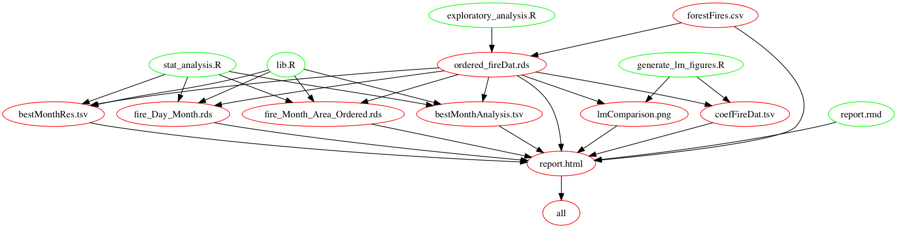

HW6 Automating Data-analysis Pipelines
================
14 November, 2017

Overall flowchart of the assignment
-----------------------------------

<center>

</center>
The above figure shows my dependency relationship of all my files. Note that I didn't include the figures in the structure graph.

Prework
-------

I make the libreary and some common variables which could be used throughout the project into the `lib.R` file, and use `source()` function to refer and take use of them.

``` r
source("lib.R")
```

Data Description
----------------

The `Forest Fires Dataset` was obtained from [UCI](https://archive.ics.uci.edu/ml/datasets/Forest+Fires). This dataset has 517 observations and 12 features (Ref 1).

Data Glance
-----------

``` r
forestFire_head <- read.csv("forestFires.csv", header = TRUE, sep = ",") %>%
    head(10)
knitr::kable(forestFire_head, digits = 2, align ="r", padding = 10)
```

|    X|    Y|  month|  day|  FFMC|    DMC|     DC|   ISI|  temp|   RH|  wind|  rain|  area|
|----:|----:|------:|----:|-----:|------:|------:|-----:|-----:|----:|-----:|-----:|-----:|
|    7|    5|    mar|  fri|  86.2|   26.2|   94.3|   5.1|   8.2|   51|   6.7|   0.0|     0|
|    7|    4|    oct|  tue|  90.6|   35.4|  669.1|   6.7|  18.0|   33|   0.9|   0.0|     0|
|    7|    4|    oct|  sat|  90.6|   43.7|  686.9|   6.7|  14.6|   33|   1.3|   0.0|     0|
|    8|    6|    mar|  fri|  91.7|   33.3|   77.5|   9.0|   8.3|   97|   4.0|   0.2|     0|
|    8|    6|    mar|  sun|  89.3|   51.3|  102.2|   9.6|  11.4|   99|   1.8|   0.0|     0|
|    8|    6|    aug|  sun|  92.3|   85.3|  488.0|  14.7|  22.2|   29|   5.4|   0.0|     0|
|    8|    6|    aug|  mon|  92.3|   88.9|  495.6|   8.5|  24.1|   27|   3.1|   0.0|     0|
|    8|    6|    aug|  mon|  91.5|  145.4|  608.2|  10.7|   8.0|   86|   2.2|   0.0|     0|
|    8|    6|    sep|  tue|  91.0|  129.5|  692.6|   7.0|  13.1|   63|   5.4|   0.0|     0|
|    7|    5|    sep|  sat|  92.5|   88.0|  698.6|   7.1|  22.8|   40|   4.0|   0.0|     0|

Detailed description of each feature could be obtained from [here](https://archive.ics.uci.edu/ml/machine-learning-databases/forest-fires/forestfires.names).

1. Perform Exploratory Analysis
-------------------------------

#### Reorder the data by month

First, let's show the bar chart of number of forest fires within each month, with `month` unordered.

<center>

</center>
Then, let's show the bar chart of number of forest fires within each month, with `month` ordered.

<center>

</center>
It shows that August and September are the two months when the forest fires happen the most.

#### Sort the month by total burned area within the month

Let's show the bar chart of total burned forest fires area within each month by another way.

<center>

</center>
The above figure sorting the month according to the total burned forest area within that month.

``` r
fire_Month_Area_Ordered <- readRDS("fire_Month_Area_Ordered.rds")
knitr::kable(fire_Month_Area_Ordered, digits = 2, align ="r", padding = 10)
```

|  arr\_month|  sum\_area|
|-----------:|----------:|
|         sep|    3086.13|
|         aug|    2297.99|
|         jul|     459.83|
|         mar|     235.26|
|         feb|     125.50|
|         dec|     119.97|
|         oct|      99.57|
|         jun|      99.30|
|         apr|      80.02|
|         may|      38.48|
|         jan|       0.00|
|         nov|       0.00|

#### Save the reordered dataset for future use and explore the reordered effect

Let's see whether the levels of `ordered_fireDat.rds` is properly ordered.

``` r
ordered_fireDat <- readRDS("ordered_fireDat.rds")
levels(ordered_fireDat$month)
```

    ##  [1] "jan" "feb" "mar" "apr" "may" "jun" "jul" "aug" "sep" "oct" "nov"
    ## [12] "dec"

``` r
levels(ordered_fireDat$day)
```

    ## [1] "sun" "mon" "tue" "wed" "thu" "fri" "sat"

Both variables `month` and `day` are ordered properly, from `jan` to `dec` and from `sun` to `sat`, respectively. Good! We could retrieve that for later use.

2. Perform Statistical Analyses
-------------------------------

Now we are interested to see the how the weekly fire count trend varies by each month.

``` r
fire_Day_Month_head <-
    readRDS("fire_Day_Month.rds") %>%
    head(15)
knitr::kable(fire_Day_Month_head, digits = 2, align ="r", padding = 10)
```

|  Day|  Month|  Value|
|----:|------:|------:|
|  sun|    jan|      1|
|  mon|    jan|      0|
|  tue|    jan|      0|
|  wed|    jan|      0|
|  thu|    jan|      0|
|  fri|    jan|      0|
|  sat|    jan|      1|
|  sun|    feb|      4|
|  mon|    feb|      3|
|  tue|    feb|      2|
|  wed|    feb|      1|
|  thu|    feb|      1|
|  fri|    feb|      5|
|  sat|    feb|      4|
|  sun|    mar|      7|

I built the above form of dataframe for the convinience of plotting using `ggplot`.

<center>

</center>
It could see that the weekly trend have silimar patterns across months. Wednesdays are the day that the forest fire happens least.

#### Fit linear model and obtain the coef.s

We are now using the `ordered_fireDat` to do some other analysis.

``` r
bestMonthAnalysis_head <- read.delim("bestMonthAnalysis.tsv") %>%
    head(16)
knitr::kable(bestMonthAnalysis_head, digits = 2, align ="r", padding = 10)
```

|  month|         term|  estimate|  std.error|  statistic|  p.value|
|------:|------------:|---------:|----------:|----------:|--------:|
|    mar|  (Intercept)|      6.49|       3.79|       1.71|     0.09|
|    mar|         wind|     -0.43|       0.72|      -0.60|     0.55|
|    oct|  (Intercept)|      4.72|       9.46|       0.50|     0.63|
|    oct|         wind|      0.55|       2.52|       0.22|     0.83|
|    aug|  (Intercept)|      5.30|      11.97|       0.44|     0.66|
|    aug|         wind|      1.76|       2.72|       0.65|     0.52|
|    sep|  (Intercept)|     18.73|      16.92|       1.11|     0.27|
|    sep|         wind|     -0.22|       4.37|      -0.05|     0.96|
|    apr|  (Intercept)|    -23.64|       9.71|      -2.44|     0.05|
|    apr|         wind|      6.97|       1.88|       3.70|     0.01|
|    jun|  (Intercept)|     10.63|      10.50|       1.01|     0.33|
|    jun|         wind|     -1.16|       2.33|      -0.50|     0.63|
|    jul|  (Intercept)|     -1.03|      20.30|      -0.05|     0.96|
|    jul|         wind|      4.12|       4.87|       0.85|     0.40|
|    feb|  (Intercept)|      5.56|       5.45|       1.02|     0.32|
|    feb|         wind|      0.19|       1.24|       0.15|     0.88|

I fit a linear model of (area ~ wind) in the above code and see whether I could find any coeff.s of some months that are significantly different from 0.

#### Select best month based on whose coefficients' are significant.

``` r
bestMonthRes <- read.delim("bestMonthRes.tsv") 
knitr::kable(bestMonthRes, digits = 2, align ="r", padding = 10)
```

|  month|         term|  estimate|  std.error|  statistic|  p.value|
|------:|------------:|---------:|----------:|----------:|--------:|
|    apr|  (Intercept)|    -23.64|       9.71|      -2.44|     0.05|
|    apr|         wind|      6.97|       1.88|       3.70|     0.01|

It could be seen that the coefficients of apr are significant, which means are not likely to be 0. In other words, for the dataset belong to apr, there might exist a relationship of area ~ wind.

3. Generate Figures
-------------------

#### Create a figure for each relative humidity levels.

According to the median of relative humidity levels (variable `RH`), I categorize `RH` into two levels, one is below median, one is above median. After that, I did the linear fit and calculate the coefficient estimates. Below is my results:

``` r
coef_FireDat <- read.delim("coefFireDat.tsv") 
knitr::kable(coef_FireDat, digits = 2, align ="r", padding = 10)
```

|  RH\_lvl|         term|  estimate|  std.error|  statistic|  p.value|
|--------:|------------:|---------:|----------:|----------:|--------:|
|  RH-high|  (Intercept)|     11.61|       3.69|       3.15|     0.00|
|  RH-high|         wind|      0.11|       0.79|       0.14|     0.89|
|   RH-low|  (Intercept)|      8.42|       3.62|       2.33|     0.02|
|   RH-low|         wind|      1.03|       0.81|       1.26|     0.21|

<center>

</center>
From the results of coefficients table and the above graph, there is some linear relationship between fire burned area and the wind speed when the relative humidity level is low.

Reference
---------

1.  P. Cortez and A. Morais. A Data Mining Approach to Predict Forest Fires using Meteorological Data. In J. Neves, M. F. Santos and J. Machado Eds., New Trends in Artificial Intelligence, Proceedings of the 13th EPIA 2007 - Portuguese Conference on Artificial Intelligence, December, Guimaraes, Portugal, pp. 512-523, 2007. APPIA, ISBN-13 978-989-95618-0-9. Available at: <http://www.dsi.uminho.pt/~pcortez/fires.pdf>
