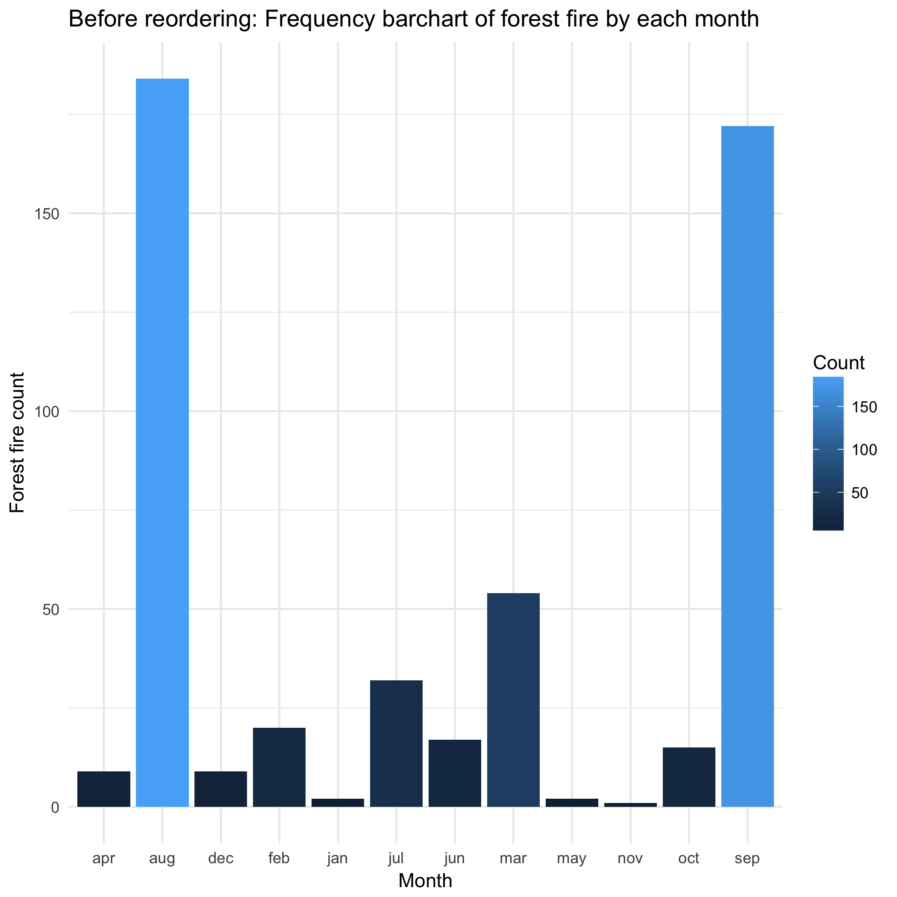
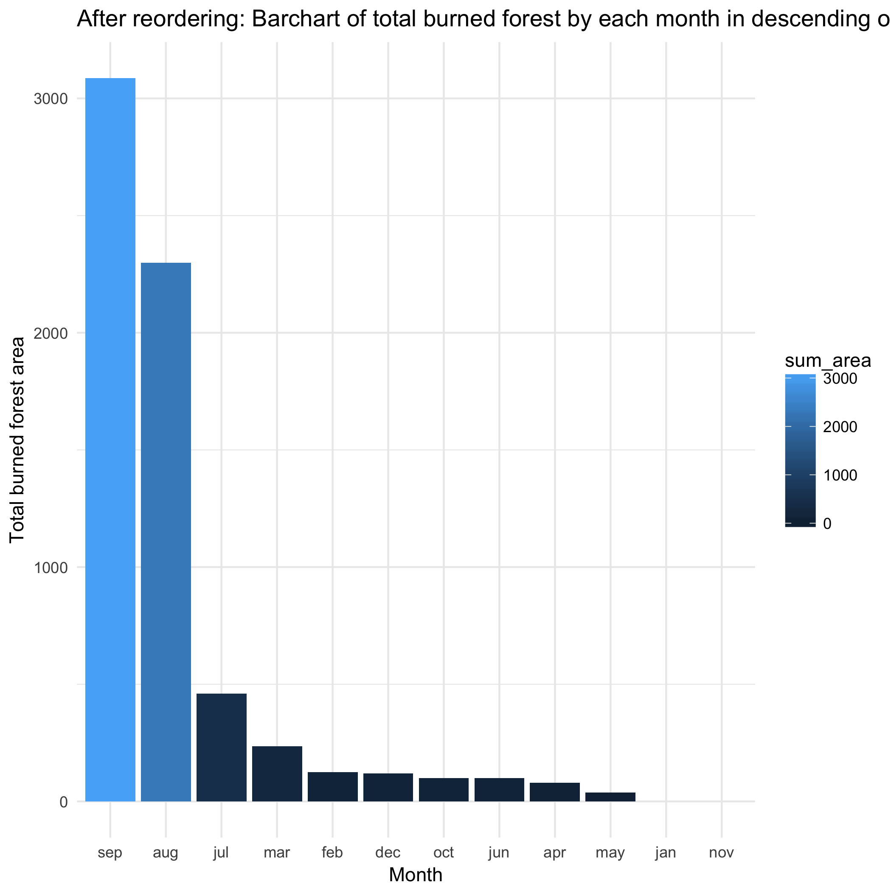

## Overall flowchart of the assignment


## Prework
```{r message=FALSE}
library(dplyr)
```


## Data Description

The `Forest Fires Dataset` was obtained from [UCI](https://archive.ics.uci.edu/ml/datasets/Forest+Fires). This dataset has 517 observations and 12 features. Detailed description of each feature could be obtained from [here](https://archive.ics.uci.edu/ml/machine-learning-databases/forest-fires/forestfires.names). 

## Data Glance

```{r results='asis'}
forestFire_head <- read.csv("forestFires.csv", header = TRUE, sep = ",") %>%
	head(10)
knitr::kable(forestFire_head, digits = 2, align ="r", padding = 10)
```

## 1. Perform Exploratory Analysis 

#### Reorder the data by month

First, let's show the bar chart of number of forest fires within each month, with `month` unordered. 
<center>
{
width=60% }
</center>

Then, let's show the bar chart of number of forest fires within each month, with `month` ordered. 
<center>
{
width=60% }
</center>

#### Sort the month by total burned area within the month

Let's show the bar chart of total burned forest fires area within each month by another way. 

<center>
{
width=60% }
</center>

```{r results='asis'}
fire_Month_Area_Ordered <- readRDS("fire_Month_Area_Ordered.rds")
knitr::kable(fire_Month_Area_Ordered, digits = 2, align ="r", padding = 10)
```


#### Save the reordered dataset for future use and explore the reordered effect

Let's see whether the levels of `ordered_fireDat.rds` is properly ordered.

```{r}
ordered_fireDat <- readRDS("ordered_fireDat.rds")
levels(ordered_fireDat$month)
levels(ordered_fireDat$day)
```

Both variables `month` and `day` are ordered properly, from `jan` to `dec` and from `sun` to `sat`, respectively. Good!

##

Now we are interested to see the how the weekly fire count trend varies by each month.

I built the following dataframe for the convinience of applying `ggplot` on it.

```{r, results = 'asis'}
fire_Day_Month_head <-
	readRDS("fire_Day_Month.rds") %>%
	head(15)
knitr::kable(fire_Day_Month_head, digits = 2, align ="r", padding = 10)
```

<center>
{
width=80% }
</center>

## 2. Perform Statistical analysis

#### Fit linear model and obtain the coef.s

We are now using the `ordered_fireDat` to do some other analysis. 

```{r results='asis'}
bestMonthAnalysis_head <- read.delim("bestMonthAnalysis.tsv") %>%
	head()
knitr::kable(bestMonthAnalysis_head, digits = 2, align ="r", padding = 10)
```

#### Select best month based on whose coefficients' are significant.

```{r results='asis'}
bestMonthRes <- read.delim("bestMonthRes.tsv") 
knitr::kable(bestMonthRes, digits = 2, align ="r", padding = 10)
```

## 3. Generate figures

#### Create a figure for each relative humidity levels.

According to the median of relative humidity levels (variable `RH`), I categorize `RH` into two levels, one is below median, one is above median. 

<center>
{
width=60% }
</center>

## Reference
1. P. Cortez and A. Morais. A Data Mining Approach to Predict Forest Fires using Meteorological Data. 
  In J. Neves, M. F. Santos and J. Machado Eds., New Trends in Artificial Intelligence, 
  Proceedings of the 13th EPIA 2007 - Portuguese Conference on Artificial Intelligence, December, 
  Guimaraes, Portugal, pp. 512-523, 2007. APPIA, ISBN-13 978-989-95618-0-9. 
  Available at: http://www.dsi.uminho.pt/~pcortez/fires.pdf